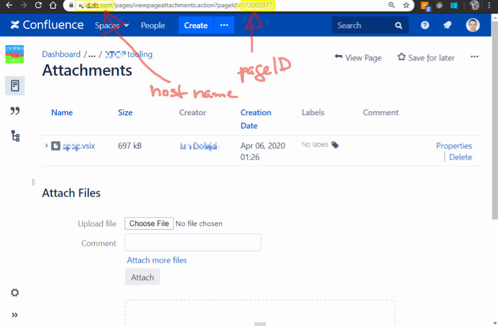

# Visual Studio Code custom extension updater for private extension marketplaces

[](https://github.com/jan-dolejsi/vscode-extension-updater/actions?query=workflow%3ABuild)
[](https://www.npmjs.com/package/vscode-extension-updater)

For context and motivation, please look at the [Private extension market](https://github.com/microsoft/vscode/issues/21839)
a.k.a _side loading_.

This package does not provide the extension marketplace (with the ability to pick an extension and install it),
but assuming you point your VS Code user population to download and install the extension manually,
as long as your extension starts this updater at its activation, this takes care of the usual workflow:

1. Checks whether new version is available
2. Asks user, whether they want to download and install now
3. Downloads the new version `.vsix` to a local temp file
4. Installs the new version
5. Offers to re-load the window to load the new version

This package purpose is to:

* Provide a base class for extension update abstracting from the type of the private repository
* Provider specific implementations (please contribute, if you see fit). So far there is support for
  * Confluence wiki

Here is a demo:



## Get Started

Fetch the package using

```bash
npm install vscode-extension-updater
```

### Using the Confluence wiki based private extension repository

Assuming you have a Confluence wiki. Package your extension using package that looks like this:

```bash
vsce package \
    --out=<package.name>.vsix \
    --baseContentUrl=https://your-confluence-wiki.com/download/attachments/123456/ \
    --baseImagesUrl=https://your-confluence-wiki.com/download/attachments/123456/
```

Where `<package.name>` is the name of your extension as defined in your `package.json`.
The `123456` stands for the page ID, where this extension's .vsix is uploaded as attachment.

This means you can setup one page per extension and thus create a catalog (just hort of marketplace)
of your private extensions.

Put this to your `extension.ts` (or `.js` if you insist) `activate` function:

```typescript
import { ConfluenceExtensionUpdater } from 'vscode-extension-updater';

export function activate(context: ExtensionContext): void {

    // ... your extension activation code...

    setTimeout(async () => {
        try {
            await new ConfluenceExtensionUpdater(context, {
                confluenceHost: 'your-confluence-wiki.com',
                confluencePageId: 123456
            }).getNewVersionAndInstall();
        }
        catch (err) {
            showError('Failed to download or install new version of the extension: ', err);
        }
    }, 30000); // give it 30sec before checking
}
```

### Implementing your own adapter to other custom back-end

Look at the `ConfluenceExtensionUpdater` class as an example of implementation.
Essentially, the only thing you may need to do is to implement this abstract method:

```typescript

import { ExtensionUpdater, ExtensionVersion } from './ExtensionUpdater';

export class ConfluenceExtensionUpdater extends ExtensionUpdater {

    constructor(context: ExtensionContext, options: YourMarketplaceOptions) {
        super(context);
        this.url = options.url;
        // ...
    }

    protected async getVersion(): Promise<ExtensionVersion> {
        // download
    }
}
```

And the base class would do the same if you integrate it into your extension's `activate` function.
